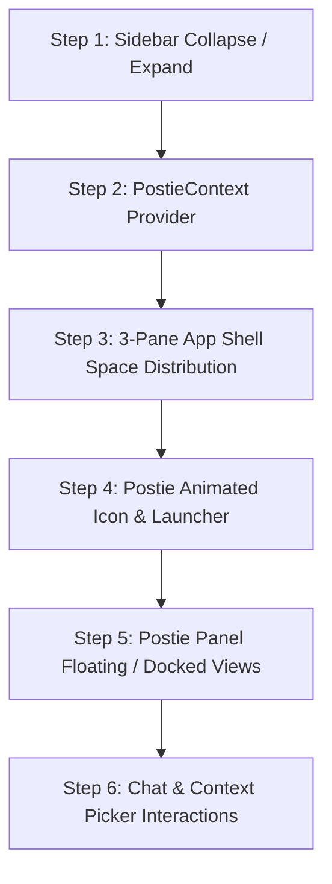

# Postie to PosterChild Retreat Migration Map

This document establishes the precise component mapping, porting strategies, and behavioral migration path from the Postie prototype to the PosterChild Retreat MVP codebase.

---

## 1. Migration Mapping Table

### Mapping 1: Sidebar Navigation
- **Postie source**: `src/components/layout/sidebar-navigation.tsx`
- **Retreat target**: `src/components/posterchild/Sidebar.tsx` (or `SidebarNavigation.tsx`)
- **Strategy**: **ADAPT**
- **Behavior to keep**:
  - `280px` expanded $\leftrightarrow$ `84px` collapsed width transitions.
  - `transition-[width] duration-200 ease-out` timing curve.
  - Collapsed header morphing: 24x24 logomark resting $\leftrightarrow$ 20x20 `layout-left` reopen icon on hover.
  - Centered icon-only navigation with floating dark tooltips on hover (300ms delay).
  - Multi-tab `localStorage` state persistence (`"posterchild_sidebar_collapsed"`).
  - Custom window event dispatch (`"posterchild-sidebar-toggle"`).
- **Visual source**:
  - PosterChild Design System `🤖 DS – 2026 (v8.0)`.
  - Primitives: `src/components/posterchild/NavItem.tsx`, `src/components/posterchild/Icon.tsx`.
  - Color & typography tokens from `reference/_shared/tokens.md`.
- **Modifications required**:
  - Replace `next/link` with `react-router-dom` `Link`.
  - Replace `next/navigation` `usePathname()` with `useLocation().pathname`.
  - Bind the bottom account area to display the retreat session indicator (e.g. `PC26`) and presenter status.

---

### Mapping 2: Postie State & Context Provider
- **Postie source**: `src/lib/postie-context.tsx`
- **Retreat target**: `src/context/PostieContext.tsx`
- **Strategy**: **PORT**
- **Behavior to keep**:
  - 3 view states: `"sidebar" | "floating" | "collapsed"`.
  - View memory: remembers `lastOpenPostieView` ("sidebar" vs "floating") when un-hiding.
  - Helper functions: `openPostie()`, `collapsePostie()`, `setPostieView()`.
  - Persistence: `localStorage.getItem("postie_view")`.
- **Visual source**:
  - N/A (pure state logic).
- **Modifications required**:
  - Zero framework dependencies. Drop into `src/context/` directly.

---

### Mapping 3: Application Layout Shell
- **Postie source**: `src/components/layout/app-shell.tsx`
- **Retreat target**: `src/layouts/AppShell.tsx`
- **Strategy**: **ADAPT**
- **Behavior to keep**:
  - 3-column horizontal flex container (`flex-row`, `h-screen`, `w-screen`, `overflow-hidden`, `bg-[#FFFDF5]`).
  - Fluid center workspace (`flex: 1 1 0%`, `min-width: 0`, `overflow-y: auto`).
  - Coordinated horizontal space sharing: center automatically expands when sidebar collapses or when Postie is un-docked.
- **Visual source**:
  - Background token `#FFFDF5`, outer padding `20px`.
- **Modifications required**:
  - Integrate retreat's floating presenter toolbar (Keyboard controls: Space/Enter/R, scene indicator) unobtrusively inside or floating above the shell.
  - Wrap retreat presenter scenes seamlessly without disturbing session synchronization.

---

### Mapping 4: Animated Postie Logo Icon
- **Postie source**: `src/components/common/postie-animated-icon.tsx`
- **Retreat target**: `src/components/posterchild/PostieAnimatedIcon.tsx`
- **Strategy**: **PORT**
- **Behavior to keep**:
  - Mathematically centered SVG rotation without on-axis wobble.
  - Sizes: `20px` and `40px`.
  - Rotation speeds: ambient (`30s`), normal (`8s`), thinking/fast (`1.5s`).
  - Subtle golden gradient fill and pulse glow animation.
- **Visual source**:
  - Exact SVG gradient and vector coordinates from source.
- **Modifications required**:
  - Convert Tailwind animation utility classes (`postie-spin-fast`, `postie-spin-ambient`) into standard CSS keyframes in `src/styles/postie-animations.css`.

---

### Mapping 5: Postie AI Assistant Panel
- **Postie source**: `src/components/layout/postie-panel.tsx`
- **Retreat target**: `src/components/posterchild/PostiePanel.tsx`
- **Strategy**: **ADAPT**
- **Behavior to keep**:
  - Tri-state rendering (docked `360px` sidebar, fixed `400x460px` floating modal, `40x40px` floating launcher).
  - Smooth geometry transitions via `transform-origin: bottom right`.
  - Automatic current route sensing badge (Home, Tell, Raise, Manage).
  - Manual context attachments (up to 3 items) with remove button.
  - Upward Context Picker Popover with search input and category filtering.
  - Simulated streaming response with realistic progressive word reveal (~35ms per chunk).
  - Smart dynamic typing status ("Reviewing today’s priorities…", "Checking upcoming events…").
  - Inline response actions (`navigate` or `prompt`).
  - Thread persistence in `localStorage`.
- **Visual source**:
  - Figma Node 358:3340 / `🤖 DS – 2026 (v8.0)`.
  - PosterChild DS tokens for borders, surfaces, typography, and button states.
- **Modifications required**:
  - Replace `next/navigation` router and path hooks with `react-router-dom`.
  - Separate business/chat logic into `usePostieChat.ts` hook.
  - Replace ad-hoc SVGs with `<Icon>` and `<Button>` primitives.

---

### Mapping 6: Attention Metrics Row
- **Postie source**: `src/components/home/attention-metrics.tsx`
- **Retreat target**: `src/components/posterchild/AttentionMetrics.tsx`
- **Strategy**: **ADAPT**
- **Behavior to keep**:
  - 3-card horizontal layout (`flex: 1 min-w-0`, `h-[102px]`, `gap-4`).
  - Uppercase category labels, large Fraunces 30px numerals.
  - Color-coded featured icon badges (Green/New Testimonials, Blue/Founders, Orange/Program Match).
- **Visual source**:
  - `src/components/posterchild/FeaturedIcon.tsx`.
  - Tokens: `font-family-serif` (Fraunces), `font-family-sans` (DM Sans).
- **Modifications required**:
  - Connect to retreat session props or retreat mock data cleanly.

---

### Mapping 7: Needs Attention Table
- **Postie source**: `src/components/home/needs-attention.tsx` & `needs-attention.css`
- **Retreat target**: `src/components/posterchild/NeedsAttention.tsx`
- **Strategy**: **ADAPT**
- **Behavior to keep**:
  - CSS container query responsiveness (`@container attention-table`).
  - 3-tier view modes: Desktop grid ($\ge 740\text{px}$), Proportional grid ($640-739\text{px}$), Stacked card list ($< 640\text{px}$).
  - Priority badges with dot indicator: Immediate (Red), Upcoming (Yellow), Ready (Green).
- **Visual source**:
  - `src/components/posterchild/Badge.tsx`.
  - Tokenized border and background colors.
- **Modifications required**:
  - Refactor classes to use retreat CSS naming conventions or scoped modules.

---

### Mapping 8: PosterChild Noticed Card
- **Postie source**: `src/components/home/posterchild-noticed.tsx`
- **Retreat target**: `src/components/posterchild/PosterChildNoticed.tsx`
- **Strategy**: **ADAPT**
- **Behavior to keep**:
  - Luxury gold gradient card (`linear-gradient(100deg, #FFFDF5 0%, #FFFDF5 42%, #FFF9E8 78%, #FFF2C7 100%)`).
  - Radial gold mesh glow and abstract AI sinusoidal SVG wave overlays.
  - 28px gold stars icon.
  - "See why this matters" CTA link.
- **Visual source**:
  - Figma Node 513:11506 / `🤖 DS – 2026 (v8.0)`.
- **Modifications required**:
  - Extract the pure SVG background layer into a clean subcomponent or asset.

---

## 2. Low-Risk Prioritization & Implementation Sequence

### Priority Ranking
1. **Priority 1: Sidebar Collapse / Expand (280px $\leftrightarrow$ 84px)**
   - **Risk**: Very Low.
   - **Impact**: Instantly provides the authentic desktop product feel; tests layout flexibility; zero impact on Firebase or retreat voting.
2. **Priority 2: PostieContext & Launcher Button**
   - **Risk**: Very Low.
   - **Impact**: Provides foundation for panel state without requiring the full 1,700-line chat implementation upfront.
3. **Priority 3: 3-Pane Shell Width Resizing**
   - **Risk**: Low.
   - **Impact**: Verifies that center workspace expands smoothly when panes toggle.
4. **Priority 4: Postie Panel & Composer Interactions**
   - **Risk**: Medium.
   - **Impact**: Complex multi-part component; best ported once shell geometry is established.

---

## 3. Recommended First Port: Sidebar Collapse / Expand

### Recommendation
**Port the Sidebar collapse/expand behavior (`280px` $\leftrightarrow$ `84px`) first.**

### Why this is the safest, highest-leverage first step:
1. **Isolated State**: The sidebar only touches its own width and a local storage flag. It does not touch Firebase Realtime Database, voting sync, or presenter controls.
2. **Visual Impact**: It immediately unlocks both the expanded workstation mode and the clean icon-only presentation mode for the projected screen.
3. **Design System Integration**: It directly exercises existing retreat primitives (`NavItem.tsx`, `Icon.tsx`) while adding the missing Postie interactions (tooltip on hover, header logo-to-icon morph).
4. **Verifiable**: Can be toggled and inspected directly at `http://localhost:5174/present/PC26` without altering user voting at `/join/PC26`.

---

## 4. Ported Implementations & Traceability Log

### 1. `PostieAnimatedIcon`
- **Source file**: `src/components/common/postie-animated-icon.tsx`
- **Target file**: `src/components/posterchild/PostieAnimatedIcon.tsx` (and re-exported from `src/components/posterchild/index.ts`)
- **Behavior reused**:
  - Exact SVG path geometry for 20x20 and 40x40 marks.
  - Mathematical center correction: `translate(-0.0759, -0.0759)` for 20px, `translate(-0.1522, -0.1518)` for 40px to eliminate rotation wobble.
  - Multi-speed continuous rotation (ambient/normal: 8s, thinking/fast: 2s, reverse: 6s) and glowing pulse states.
- **Visual changes made**:
  - Bound to PosterChild gold brand gradient (`#F4B400` to `#FFCC33`) and drop-shadow glow.
- **Framework adaptation made**:
  - Converted Tailwind animation class names to clean CSS keyframe rules in `src/styles.css` (`@keyframes postie-spin`, `@keyframes postie-glow`).

### 2. `PostieContext`
- **Source file**: `src/lib/postie-context.tsx`
- **Target file**: `src/context/PostieContext.tsx`
- **Behavior reused**:
  - Tri-modal view state: `"sidebar"` (docked 360px), `"floating"` (400x460px modal), and `"collapsed"` (40x40 launcher).
  - Remembers `lastOpenPostieView` so opening from collapsed mode restores previous view mode.
  - LocalStorage persistence (`"postie_view"`, `"postie_last_open"`).
  - Helper functions: `openPostie()`, `collapsePostie()`, `setPostieView()`.
- **Visual changes made**:
  - None (headless state layer).
- **Framework adaptation made**:
  - Pure React context, zero Next.js dependencies, wrapped inside Vite app shell in `src/pages/Present.tsx`.

### 3. `PostiePanel`
- **Source file**: `src/components/layout/postie-panel.tsx`
- **Target file**: `src/components/PostiePanel.tsx`
- **Behavior reused**:
  - Header with Chats selector dropdown, new chat button, and view mode switcher (Sidebar, Floating, Hide chat).
  - Empty intro state with 40x40 animated icon, greeting, and contextual starter prompt pills.
  - Active conversation thread with user bubbles (aligned right, `#FAFAFA`) and Postie bubbles (aligned left, `#FFFFFF` with copy action, grounded context tags, and suggested action pills).
  - Dynamic simulation of thinking state with speed-boosted icon animation.
  - Upward context picker popover with search filter and item toggling.
  - Context bar with active page chip and attached context tags.
  - Anchored 110px composer with textarea (`Enter` to submit, `Shift+Enter` for newline), plus action, settings, microphone, and gold submit button.
  - Scene-reactive copy: adapts simulated conversation to current retreat scene (Dashboard: initial guidance; Voting: active room pulse; Result: team choice consensus summary).
- **Visual changes made**:
  - Aligned typography and colors to PosterChild DS tokens (`var(--pc-ref-brand-solid)`, `var(--pc-ref-border-postie)`, `var(--pc-ref-text-primary)`).
  - Applied 220ms ease-out transitions and `transform-origin: bottom right`.
- **Framework adaptation made**:
  - Replaced Next.js `useRouter` with React state and `react-router-dom`.
  - Embedded retreat session awareness so Postie comments on live retreat status without altering Firebase or voting.

### 4. `AppShell` Space Coordination
- **Source file**: `src/components/layout/app-shell.tsx`
- **Target file**: `src/pages/Present.tsx` & `src/styles.css`
- **Behavior reused**:
  - Coordinated 3-region space management:
    - Sidebar: expanded `280px` or collapsed `84px`.
    - Center workspace: fluidly consumes available width ($740\text{px} \rightarrow 936\text{px} \rightarrow 1120\text{px} \rightarrow 1316\text{px}$).
    - Postie: docked `360px` or collapsed/floating `0px` in layout flow.
- **Visual changes made**:
  - Preserved discreet floating presenter controls dock without layout clipping.
- **Framework adaptation made**:
  - Implemented cleanly with flexbox and out-of-flow fixed overlays for floating modal and launcher.

### 5. `PosterChildNoticed`
- **Source file**: `src/components/home/posterchild-noticed.tsx`
- **Target file**: `src/components/HomeWorkspace.tsx`
- **Behavior reused**:
  - Luxury gold gradient background (`linear-gradient(100deg, #FFFDF5 0%, #FFFDF5 42%, #FFF9E8 78%, #FFF2C7 100%)`).
  - Sinusoidal harmonic dual-wave SVG lines with constellation nodes and micro-sparkles.
  - 28px gold stars badge and CTA link.
- **Visual changes made**:
  - Styled with PosterChild DS color tokens.
- **Framework adaptation made**:
  - Inline SVG overlay component in React with responsive viewBox.

