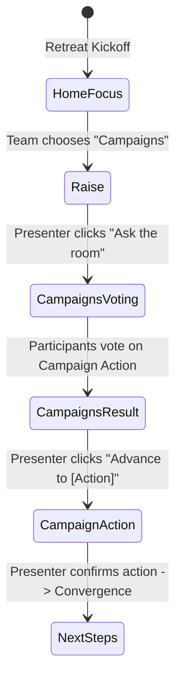

# Campaigns Branch Decision Flow: "campaigns-next"

This document specifies the end-to-end architecture, state machine, component contracts, and visual design patterns for the **Campaigns Branch Decision Flow (`campaigns-next`)** through to **Campaign Action** and convergence handoff.

---

## 1. Flow Overview

1. **Home**: Audience chooses **Campaigns**.
2. **Navigation**: Presenter advances to `/present/:sessionId/raise`.
3. **Decision Active**: `state.activeDecisionId = 'campaigns-next'`.
4. **Voting**: Audience remote `/join/:sessionId` presents the three candidate campaign actions.
5. **Result**: Team choice is highlighted on `/raise` inside the *Active Campaign* section with PosterChild Design System `Badge` and gold border accent. Postie delivers contextual feedback.
6. **Advance**: Presenter clicks *"Advance to [Action]"* → navigates to `/present/:sessionId/raise/:action` (`launch`, `refine`, or `ask-postie`).
7. **Campaign Action**: Dynamically renders the selected workflow (pre-flight launch verification, editorial copy polish, or Postie AI strategic analysis).
8. **Convergence**: Clicking *"Proceed to Convergence Roadmap"* transitions to `/present/:sessionId/next-steps?source=campaign&action=[action]`.

---

## 2. Decision Node Specification: `campaigns-next`

- **Decision ID**: `campaigns-next`
- **Question**: *What should we do with the campaign?*
- **Description**: *Decide the immediate strategic move for the Fall Impact Campaign.*

### Candidate Action Options

| Option ID | Action Label | Supporting Copy | Icon | Destination Route |
| :--- | :--- | :--- | :--- | :--- |
| `launch` | Launch campaign | Everything is ready. Publish and start reaching supporters. | `coins-hand` | `/raise/launch` |
| `refine` | Refine first | Review the message, audience, and campaign details before launch. | `file-06` | `/raise/refine` |
| `ask-postie` | Ask Postie | Let Postie review the campaign and recommend the strongest next move. | `stars-01` | `/raise/ask-postie` |

---

## 3. Visual States on `/raise`

### A. Idle State (`decisionStatus: 'idle'`)
- Full PosterChild Design System fundraising workspace.
- Metrics row: Opportunities (24), In progress (7), Needs attention (3).
- Active Campaign section displaying Fall Impact Campaign with $75,000 goal and 2,400 active supporters.
- 3 Next Move options rendered cleanly with `DecisionChoice`.
- Postie greeting: *"The Fall Impact Campaign has $75,000 in target goals ready across 2,400 active supporters. What next move should we make?"*

### B. Open Voting State (`decisionStatus: 'open'`)
- Active campaign header shows `Live Voting` indicator badge.
- Action cards receive `.pc-decision-choice--voting` with subtle interactive border and cursor pointer.
- Presenter sees real-time vote totals (`N (X%)`) derived canonically via `getDecisionTallies`.
- Postie notes: *"The team is deciding what to do with the campaign."*

### C. Result State (`decisionStatus: 'result'`)
- Winning action card receives `.pc-decision-choice--winner`:
  - Warm surface (`#FFFDF5`)
  - 1.5px solid `#F4B400` border
  - Brand `Badge` with checkmark (`Team choice`)
  - Primary advance link (*"Proceed with [Action] →"*)
- Losing action cards remain completely legible with `.pc-decision-choice--muted` (opacity 0.9).
- Postie dynamically comments on the specific winner:
  - **Launch**: *"The team chose to launch. The campaign is ready, so let's move into the final launch review."*
  - **Refine**: *"The team chose to refine first. Let's tighten the message and audience before launch."*
  - **Ask Postie**: *"The team chose Postie. I'll review the campaign and recommend the strongest next move."*

---

## 4. Mobile Remote Interaction (`/join`)

When `state.activeDecisionId === 'campaigns-next'`:
1. Question: *"What should we do with the campaign?"*
2. Options:
   - **Launch campaign**: *"Everything is ready. Publish and start reaching supporters."*
   - **Refine first**: *"Review the message, audience, and campaign details before launch."*
   - **Ask Postie**: *"Let Postie review the campaign and recommend the strongest next move."*
3. Tapping an option immediately highlights it in gold with a checkmark and confirms *"Vote sent"*.
4. Selection locks when voting closes and displays *"Team choice locked in. Winning choice: '[Winner Label]'"*.

---

## 5. Campaign Action Dynamic Renderer

Located at [src/pages/product/CampaignAction.tsx](file:///Users/dmenendez/Documents/Coding/posterchild-retreat-mvp/posterchild-retreat-mvp/src/pages/product/CampaignAction.tsx):
- Dynamically responds to `:action` URL parameter (`launch`, `refine`, or `ask-postie`).
- **Launch State**: Pre-flight verification of 2,400 recipient lists, $75K donation tiers, and real-time conversion trackers.
- **Refine State**: 3 targeted copy suggestions (leading with community outcomes, clarifying impact per tier, and urgent timeline hooks).
- **Ask Postie State**: Simulated Postie recommendations (lead with community outcome for 24% higher conversion, tighten pledge CTA, segment returning donors).
- Primary CTA navigates to `/next-steps` with `source=campaign` and `action=[action]`.
