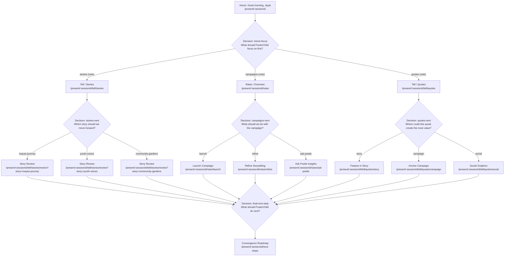

# PosterChild Retreat Decision Graph

This document details the branching decision architecture for the PosterChild Retreat 2026 application. Rather than a linear slide sequence, the retreat functions as an interactive, live-branched product demonstration driven by audience consensus from the participant remote (`/join/:sessionId`).

## Node Manifest

### 1. Root Decision: `home-focus`
- **Question**: "What should PosterChild focus on first?"
- **Context**: Home Dashboard attention cards and metrics.
- **Choices**:
  - `stories` → Destination: `/tell/stories` (Branch A)
  - `campaigns` → Destination: `/raise` (Branch B)
  - `quotes` → Destination: `/tell/quotes` (Branch C)

### 2. Second-Level Decision: `stories-next`
- **Question**: "Which story should we move forward?"
- **Context**: Stories library triage.
- **Choices**:
  - `mayas-journey` → `/tell/stories/review?story=mayas-journey`
  - `youth-voices` → `/tell/stories/review?story=youth-voices`
  - `community-gardens` → `/tell/stories/review?story=community-gardens`

### 3. Second-Level Decision: `campaigns-next`
- **Question**: "What should we do with the campaign?"
- **Context**: Summer Youth Initiative strategy.
- **Choices**:
  - `launch` → `/raise/launch`
  - `refine` → `/raise/refine`
  - `ask-postie` → `/raise/ask-postie`

### 4. Second-Level Decision: `quotes-next`
- **Question**: "Where could this quote create the most value?"
- **Context**: High-resonance community quote activation.
- **Choices**:
  - `story` → `/tell/quotes/story`
  - `campaign` → `/tell/quotes/campaign`
  - `social` → `/tell/quotes/social`

### 5. Convergence Decision: `final-next-step`
- **Question**: "What should PosterChild do next?"
- **Context**: Cross-branch synthesis into active product backlog.
- **Choices**:
  - `publish-all` → `/next-steps?action=publish`
  - `export-campaign` → `/next-steps?action=export`
  - `explore-postie` → `/next-steps?action=postie`
