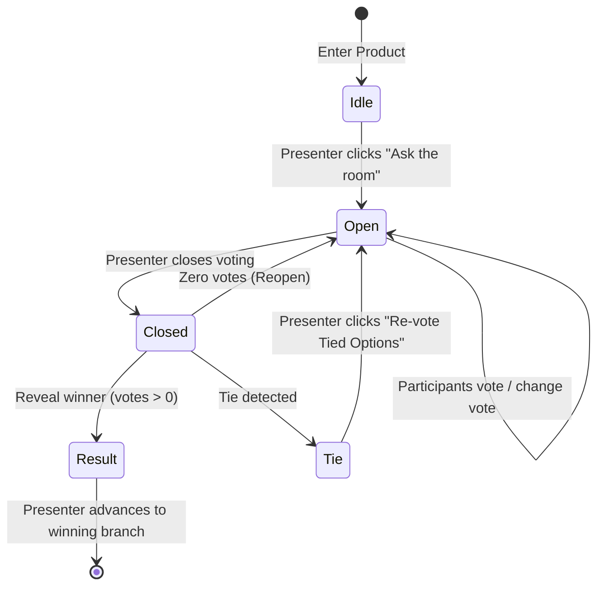

# Home Decision Flow: "home-focus"

This document specifies the architecture, state machine, component contracts, and visual design patterns for the **PosterChild Retreat 2026 First Decision Flow (`home-focus`)**.

---

## 1. Executive Summary & Design Principle

The primary goal of the Home decision experience is to keep PosterChild feeling like a **real, living product dashboard**, rather than a gamified polling widget.

### Separation of Concerns
- **Product Data vs. Retreat Data**:
  - Business metrics on MetricCards are immutable product facts (**Stories = 3**, **Campaigns = 1**, **Quotes = 5**).
  - Audience votes are retreat collaboration data (**Stories = N votes**, **Campaigns = N votes**, **Quotes = N votes**).
  - Product metrics are NEVER overwritten with vote counts (e.g. no "51 votes" replacing "5").
- **Product Component vs. Retreat Behavior**:
  - `MetricCard` is a pure PosterChild Design System component.
  - `DecisionChoice` is a retreat-aware wrapper component that decorates product cards with interactive states, brand borders, and badges without polluting the base component.

---

## 2. Decision Node Specification

- **Decision ID**: `home-focus`
- **Question**: *What should PosterChild focus on first?*
- **Description**: *Help the team decide where to focus our energy in today’s session.*

### Canonical Options & Destinations

| Option ID | Semantic Label | Icon | Product Metric | Destination Route | Next Decision ID |
| :--- | :--- | :--- | :--- | :--- | :--- |
| `stories` | Stories | `folder` | 3 | `/present/:sessionId/tell/stories` | `stories-next` |
| `campaigns` | Campaigns | `announcement-02` | 1 | `/present/:sessionId/raise` | `campaigns-next` |
| `quotes` | Quotes | `file-06` | 5 | `/present/:sessionId/tell/quotes` | `quotes-next` |

---

## 3. State Machine & Visual States



### A. Idle State (`scene: 'dashboard'`, `decisionStatus: 'idle'`)
- **Desktop Home**: Clean product dashboard. Standard `MetricCard`s, standard `AttentionTable` rows, standard Postie greeting. No vote pills, no progress bars, no polling banners.
- **Mobile `/join`**: *"You’re connected. Look at the big screen to see the session begin 👀"*

### B. Open Voting State (`decisionStatus: 'open'`)
- **Desktop Home**:
  - Three `MetricCard`s are decorated with `.pc-decision-choice--voting` (subtle border hover, cursor pointer).
  - Presenter sees subtle live vote totals in `.pc-ref-vote-pill` on the `AttentionTable` and `.pc-decision-choice__feedback-slot` (e.g. `4 votes (57%)`).
  - Product numbers (3, 1, 5) remain untouched.
- **Mobile `/join`**:
  - Displays question: *"What should PosterChild focus on first?"*
  - Three large tap-friendly options (`Stories`, `Campaigns`, `Quotes`) with descriptions and PosterChild icons.
  - Upon tapping: card is highlighted in gold (`is-selected`), displays checkmark, and shows confirmation banner: *"Vote sent — Tap another option to change your vote"*.

### C. Closed State (`decisionStatus: 'closed'`)
- **Desktop Home**: Voting is locked. Presenter dock shows *"Reveal team choice"*.
- **Mobile `/join`**: If 0 votes, shows *"Voting paused. Waiting for presenter..."*. Otherwise locks selection.

### D. Result State (`decisionStatus: 'result'`)
- **Desktop Home**:
  - Winning choice receives `.pc-decision-choice--winner`:
    - Warm ivory surface (`#FFFDF5`)
    - Brand gold border (1.5px `#F4B400`)
    - Gold glow shadow (`rgba(244, 180, 0, 0.14)`)
    - PosterChild DS `Badge` with leading checkmark (`Team choice`)
  - Winning `AttentionTable` row receives `.is-team-choice` with `3px solid #F4B400` left indicator and primary action button (e.g. *"Review stories →"*).
  - Other options remain legible and normal (`.pc-decision-choice--muted` opacity `0.9`).
  - Presenter dock shows: *"Advance to [Winner Label]"* with Space shortcut.
- **Mobile `/join`**: Displays *"Team choice locked in. Winning choice: '[Winner]'. Look at the big screen!"*

### E. Tie State (`decisionStatus: 'tie'`)
- **Desktop Home**: Tied choices receive `.pc-decision-choice--tie` (dashed `#FDB022` border, warm `#FEF0C7` surface, `Tied` badge).
- **Presenter Dock**: Displays *"Re-vote Tied Options"* button.
- **Mobile `/join`**: Shows *"It’s a tie! The presenter is setting up a quick tie-breaker vote. Get ready..."*

---

## 4. Postie Winner Responses

When the result is revealed, Postie automatically surfaces simulated contextual AI assistance matching the winning branch:

- **Stories Winner**:
  > *"The team chose Stories. You have 3 stories ready for review, so let's start there."*
  > Context tags: `['Stories', 'Team Choice']`

- **Campaigns Winner**:
  > *"The team chose Campaigns. There's already a campaign ready to launch."*
  > Context tags: `['Campaigns', 'Team Choice']`

- **Quotes Winner**:
  > *"The team chose Quotes. Five strong quotes are ready to put to work."*
  > Context tags: `['Quotes', 'Team Choice']`

---

## 5. Canonical Tally Calculation

To prevent negative numbers, division by zero, or inconsistent vote percentages, all counts and percentages are derived strictly through `getDecisionTallies`:

```ts
const tallies = getDecisionTallies(sessionState, activeDecision);
// Returns:
// {
//   options: {
//     stories: { count: 3, percentage: 60 },
//     campaigns: { count: 1, percentage: 20 },
//     quotes: { count: 1, percentage: 20 }
//   },
//   totalVotes: 5
// }
```
