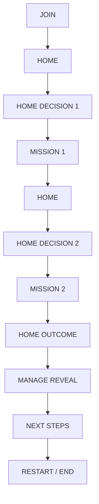

# PosterChild Retreat Flow — Master Architecture & Presentation Model

## 1. Executive Overview

"The Future of PosterChild" retreat presentation is structured as a collaborative, interactive journey where the audience helps guide the product exploration without micro-managing every click.

- **Presenter Role**: Navigates the desktop application, drives the storytelling cadence, and confirms execution steps.
- **Audience Role**: Votes synchronously from mobile devices at intentional fork moments to decide what area of the product the team tackles next.
- **Postie Role**: Acts as an active co-pilot, offering real-time recommendations, synthesizing narrative insights, and contextualizing decisions without auto-redirecting routes.

---

## 2. Core Experience Lifecycle



> **Important Rule**: **No audience vote occurs after the second completed mission.** The audience client automatically remains in a calm presentation-in-progress / waiting state while the presenter reveals Manage and advances to Next Steps.

### Turn-by-Turn Stage Breakdown

1. **STAGE 0 — Join & Orientation (`/present/:sessionId` / `scene: 'join'`)**:
   - Welcome screen with QR code and live connection counter.
   - Presenter presses `Space` to enter the product workspace.

2. **STAGE 1 — Home & First Decision (`/present/:sessionId`)**:
   - Definitive Home dashboard renders greetings, metrics, Attention items (Kresge Foundation), and Suggested Story.
   - Presenter initiates vote (`Space` or "Ask the room").
   - Audience mobile devices display active choices (dynamically filtered by `enabled: true` flags):
     - `ask-postie`: *Ask Postie*
     - `needs-attention`: *See what needs attention*
     - `create-story`: *Create a new story* (Optional placeholder branch)
     - `new-testimonials`: *Explore new testimonials*
     - `suggested-story`: *View the suggested story*
   - Voting closes; winner revealed on big screen and mobile.
   - Presenter confirms navigation to Mission 1.

3. **STAGE 2 — Product Mission 1**:
   - **Branch A — Kresge Single-Screen Mission (`/raise/opportunities/kresge`)**:
     - *IDLE*: Presenter arrives on Kresge Opportunity Detail ($150k USD, 92% match). Clicks "Ask the room".
     - *VOTING*: Decision `kresge-next-action` (Review requirements, Strengthen application, Ask Postie).
     - *RESULT / ACTION*: Resolves in-screen.
     - *COMPLETION*: Dispatches `COMPLETE_MISSION` (`kresge-funding`).
     - *RETURN HOME*: Presenter returns Home (`H` / `Space`).
   - **Branch B — Youth Career Pathways Story Detail (`/tell/stories/review?story=youth-career-pathways&tab=social`)**:
     - *IDLE*: Presenter arrives on Youth Career Pathways story detail (default `tab=social`).
     - *VOTING*: Decision `story-output`:
       - `social`: *Social media* (Instagram spotlight carousel)
       - `article`: *Article* (Formatted draft)
       - `ask-postie`: *Ask Postie* (AI channel evaluation)
     - *RESULT / ACTION*:
       - If Social: Sets `tab=social` -> Presenter clicks "Publish to Socials".
       - If Article: Sets `tab=article` -> Presenter clicks "Share Article".
       - If Ask Postie: Postie recommends starting with social -> Presenter clicks "Use Postie’s recommendation & Publish".
     - *COMPLETION*: Dispatches `COMPLETE_MISSION` (`youth-career-story`).
     - *RETURN HOME*: Presenter returns Home (`H` / `Space`).
   - **Branch C — Connect / New Testimonials Mission (`/tell/connect`)**:
     - *IDLE*: Presenter arrives on Connect overview ("Hear from your community", active conversations). Clicks "Ask the room".
     - *VOTING*: Decision `connect-next-action` (Review the theme, Use responses in a story, Ask Postie).
     - *RESULT / ACTION*:
       - If **Review Theme**: Resolves in-screen showing signals across 7 responses -> Dispatches `COMPLETE_MISSION` (`new-testimonials-connect`) -> Return Home (`H` / `Space`).
       - If **Ask Postie**: Updates Postie recommendation banner -> Presenter clicks "Follow Postie’s recommendation" -> Complete Theme Review -> Dispatches `COMPLETE_MISSION` (`new-testimonials-connect`) -> Return Home (`H` / `Space`).
       - If **Use in Story**: Dispatches `START_MISSION` (`youth-career-story`) and navigates directly to `/tell/stories/review?story=youth-career-pathways&tab=social`. Continues into the Story Detail mission without double-counting mission completion.
   - **Branch D — Create Story Placeholder Branch (`/tell/stories/create`)**:
     - *IDLE / ACTIVE*: Presenter arrives on Create Story placeholder.
     - *COMPLETION*: Presenter clicks "Complete placeholder mission" -> dispatches `COMPLETE_MISSION` (`create-story-flow`).
     - *RETURN HOME*: Presenter returns Home (`H` / `Space`).

4. **STAGE 3 — Home Progress & Second Decision (`/present/:sessionId`)**:
   - State preserves `completedMissionIds` and `decisionHistory`.
   - Subtle progress banner indicates 1 action completed.
   - `getAvailableHomeOptions()` dynamically filters out completed missions and their converged siblings.
   - Presenter initiates vote for Mission 2 among the remaining fresh priorities.
   - Presenter advances to Mission 2.

5. **STAGE 4 — Product Mission 2**:
   - Team completes the second strategic focus area.
   - Mission action finalized.
   - Presenter clicks **"Complete Mission"** and **"Return to Home"** (`H`).

6. **STAGE 5 — Home Outcome State & Manage Architectural Reveal (`/present/:sessionId/manage`)**:
   - `completedMissionIds.length >= 2` triggers `canRevealManage(state) === true`.
   - **No audience vote occurs after the second mission.**
   - Home renders an outcome state (*"Today’s retreat priorities completed (2 actions) — Today’s work is moving forward"*).
   - Presenter primary action in dock & header banner becomes:
     **"Reveal how PosterChild knows all of this"** (driven by `RETREAT_CONFIG.manageRevealEnabled === true`).
   - If `manageRevealEnabled === false`, advances directly to Next Steps.
   - In Manage Reveal, the narrative is *"So where is PosterChild getting all of this context from?"*, showcasing the 6 organizational memory areas:
     - **Knowledge**: Context repository and program knowledge graph.
     - **Assets**: Digital media and quote library.
     - **Organization**: Partner touchpoints and grant rubrics.
     - **People**: Community voices, scholars, and beneficiaries.
     - **Connections**: Relationship linkages across stories and funders.
     - **Admin**: System governance.
   - `/join/:sessionId` displays a calm status: *"PosterChild is showing how it knows your organization."*
   - Presenter advances with **"Continue to Next Steps"** (`Space` / `Enter` / `→`).

7. **STAGE 6 — Next Steps & Synthesis (`/present/:sessionId/next-steps`)**:
   - Minimal, intentional closing screen:
     - **Title**: *"The future of PosterChild"*
     - **Supporting line**: *"More capacity. Less friction. More time for the mission."*
     - **3 Conceptual Layers**:
       1. **Explore**: Surfacing community voice, testimonials, and grant opportunities automatically.
       2. **Decide**: Guiding real-time consensus with Postie without endless meetings.
       3. **Act**: Generating ready-to-ship narrative assets, applications, and donor touchpoints.
     - **Closing synthesis**: *"PosterChild helps nonprofit teams understand what matters, decide what to do next, and move the work forward. The product gets smarter because it understands the organization behind the work."*
     - **Dynamic Retreat Summary**: Highlights the 2 completed retreat missions derived from `completedMissionIds`.
   - **Presenter Controls**:
     - `Return to Home` (`H`) — safely navigates back to Home without resetting retreat state.
     - `Restart experience` (`R`) — 2-tap safe reset confirmation that clears session progress and returns to Welcome/Join.

---

## 3. Mission Architecture & Registry

All missions are registered centrally in `src/config/retreatFlow.ts`:

```typescript
export interface RetreatMission {
  id: string;
  label: string;
  description: string;
  entryRoute: string;
  sourceDecisionId: string;
  sourceOptionId: string;
  completionRoute?: string;
  returnToHome: boolean;
  homeEffect?: string;
  nextDecisionId?: string;
  targetPillar: 'Tell' | 'Raise' | 'Manage' | 'Connect';
  convergenceMissionId?: string;
  enabled?: boolean;
  status?: 'locked' | 'available' | 'active' | 'completed' | 'placeholder';
}
```

### Active Mission Registry

1. **`kresge-funding`**:
   - **Label**: Kresge Foundation Funding Opportunity
   - **Source Option**: `needs-attention`
   - **Entry Route**: `/raise/opportunities/kresge`
   - **Next Decision**: `kresge-next-action`
   - **Enabled**: `true` | **Status**: `available`

2. **`kresge-postie`**:
   - **Label**: Ask Postie: Strategy Recommendation
   - **Source Option**: `ask-postie`
   - **Entry Route**: `/raise/opportunities/kresge`
   - **Next Decision**: `kresge-next-action`
   - **Enabled**: `true` | **Status**: `available`

3. **`youth-career-story`**:
   - **Label**: Youth Career Pathways Story
   - **Source Option**: `suggested-story`
   - **Entry Route**: `/tell/stories/review?story=youth-career-pathways&tab=social`
   - **Next Decision**: `story-output`
   - **Completion**: In-screen output selection (`tab=social` or `tab=article`) -> Publish -> Return Home
   - **Enabled**: `true` | **Status**: `available`

4. **`new-testimonials-connect`**:
   - **Label**: Community Testimonials & Connect
   - **Source Option**: `new-testimonials`
   - **Entry Route**: `/tell/connect`
   - **Next Decision**: `connect-next-action`
   - **Convergence**: When `use-in-story` wins, converges directly into `youth-career-story`
   - **Enabled**: `true` | **Status**: `available`

5. **`create-story-flow`**:
   - **Label**: Create a New Story
   - **Source Option**: `create-story`
   - **Entry Route**: `/tell/stories/create`
   - **Completion**: In-screen presenter completion -> Return to Home
   - **Enabled**: `true` | **Status**: `placeholder`

---

## 4. Keyboard & Presenter Shortcuts

| Shortcut | Context | Action |
| :--- | :--- | :--- |
| `Space` / `Enter` | Join Screen | Enter Product |
| `Space` / `Enter` | Home Idle | Ask the Room (Open Voting) |
| `Space` / `Enter` | Home Voting | Reveal Team Choice (Close Voting) |
| `Space` / `Enter` | Home Result | Advance to Winner Destination |
| `Space` / `Enter` | Mission Idle | Ask the Room |
| `Space` / `Enter` | Mission Voting | Reveal Team Choice |
| `Space` / `Enter` | Mission Result / Action | Complete Mission & Advance |
| `Space` / `Enter` | 2 Missions Complete | Reveal Manage Overview |
| `Space` / `Enter` | Manage Overview | Advance to Next Steps |
| `H` | Any Product Screen | Return to Home |
| `R` | Anywhere | Safe Reset (Requires 2nd tap within 3s) |
| `Escape` | Reset Confirming | Cancel Reset |
