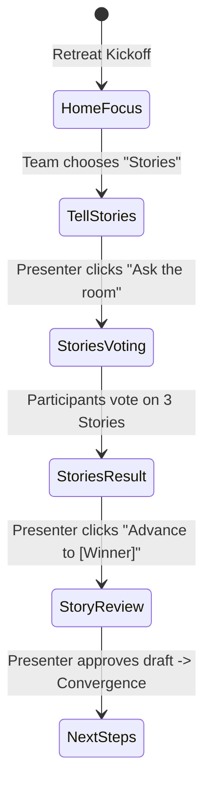

# Stories Branch Decision Flow: "stories-next"

This document details the end-to-end architecture, state machine, component contracts, and visual design patterns for the **Stories Branch Decision Flow (`stories-next`)** through to **Story Review** and convergence preparation.

---

## 1. Flow Overview

1. **Home**: Audience chooses **Stories**.
2. **Navigation**: Presenter advances to `/present/:sessionId/tell/stories`.
3. **Decision Active**: `state.activeDecisionId = 'stories-next'`.
4. **Voting**: Audience remote `/join/:sessionId` presents the three candidate stories.
5. **Result**: Team choice is highlighted on `/tell/stories` with PosterChild Design System `Badge` and gold border accent. Postie delivers contextual feedback.
6. **Advance**: Presenter clicks *"Advance to [Winning Story]"* → navigates to `/present/:sessionId/tell/stories/review?story=[winningOptionId]`.
7. **Story Review**: Dynamically renders the winning narrative arc, verified quotes, word counts, and editorial notes.
8. **Convergence**: Clicking *"Approve & Advance"* transitions to the shared convergence roadmap (`/next-steps`).

---

## 2. Decision Node Specification: `stories-next`

- **Decision ID**: `stories-next`
- **Question**: *Which story should we move forward?*
- **Description**: *Select the community story to polish, review, and finalize.*

### Candidate Story Options

| Option ID | Story Title | Program Area | Excerpt Summary | Word Count | Destination Route |
| :--- | :--- | :--- | :--- | :--- | :--- |
| `mayas-journey` | Maya’s Journey: Finding Belonging Through Mentorship | Youth Mentorship | First-generation scholar finding belonging through mentorship. | 840 words | `/tell/stories/review?story=mayas-journey` |
| `youth-voices` | Youth Voices Initiative: Peer Mental Health Circles | Student Wellbeing | High school students building peer-led mental health circles. | 920 words | `/tell/stories/review?story=youth-voices` |
| `community-gardens` | Community Gardens: Sowing Roots and Trust | Urban Agriculture | Transforming 4 vacant urban parcels into communal food sanctuaries. | 750 words | `/tell/stories/review?story=community-gardens` |

---

## 3. Visual States on `/tell/stories`

### A. Idle State (`decisionStatus: 'idle'`)
- Full PosterChild Design System table.
- All 3 stories displayed with status `Badge` (`Ready for review`), program tag, and word count.
- Action column displays default arrow link.
- Postie greeting: *"Here are the stories that need attention..."*

### B. Open Voting State (`decisionStatus: 'open'`)
- Table header shows `Live Voting` indicator badge.
- Story rows receive `.pc-product-table-row.is-voting` with subtle interactive border and cursor pointer.
- Far right column displays real-time vote totals (`N (X%)`) derived canonically via `getDecisionTallies`.
- Postie notes: *"The team is deciding which story to move forward. Remote votes are arriving in realtime from participants."*

### C. Result State (`decisionStatus: 'result'`)
- Winning story row receives `.is-team-choice` styling:
  - Warm surface (`#FFFDF5`)
  - 3px solid `#F4B400` left indicator
  - Brand `Badge` with checkmark (`Team choice`)
  - Primary button action: *"Review story →"*
- Losing stories remain completely legible with `.is-muted-item` (opacity 0.85).
- Postie dynamically comments on the specific winner:
  - **Maya's Journey**: *"The team chose Maya’s Journey. This piece has high resonance with youth mentorship funders. Let's review the narrative arc."*
  - **Youth Voices**: *"The team chose Youth Voices Initiative. A strong peer-led mental health story. Let's review the narrative arc."*
  - **Community Gardens**: *"The team chose Community Gardens. An impactful story on grassroots food security. Let's review the narrative arc."*

---

## 4. Mobile Remote Interaction (`/join`)

When `state.activeDecisionId === 'stories-next'`:
1. Question: *"Which story should we move forward?"*
2. Options:
   - **Maya’s Journey**: *"First-generation scholar finding belonging through mentorship."*
   - **Youth Voices Initiative**: *"High school students building peer-led mental health circles."*
   - **Community Gardens Impact**: *"Transforming vacant urban lots into communal food sanctuaries."*
3. Tapping an option immediately highlights it in gold with a checkmark and confirms *"Vote sent"*.
4. Selection locks when voting closes and displays *"Team choice locked in. Winning choice: '[Winner Label]'"*.

---

## 5. Story Review Dynamic Renderer

Located at [src/pages/product/StoryReview.tsx](file:///Users/dmenendez/Documents/Coding/posterchild-retreat-mvp/posterchild-retreat-mvp/src/pages/product/StoryReview.tsx):
- Reads the winning story from `?story=[id]` or `sessionState.winningOptionId`.
- Never hard-codes Maya as the single outcome; dynamically injects the appropriate author, narrative excerpt, editorial notes, and word counts for all 3 stories.
- Postie editorial box displays verified impact metrics.
- Primary CTA *"Approve & Advance"* navigates to `/next-steps` with source context.
