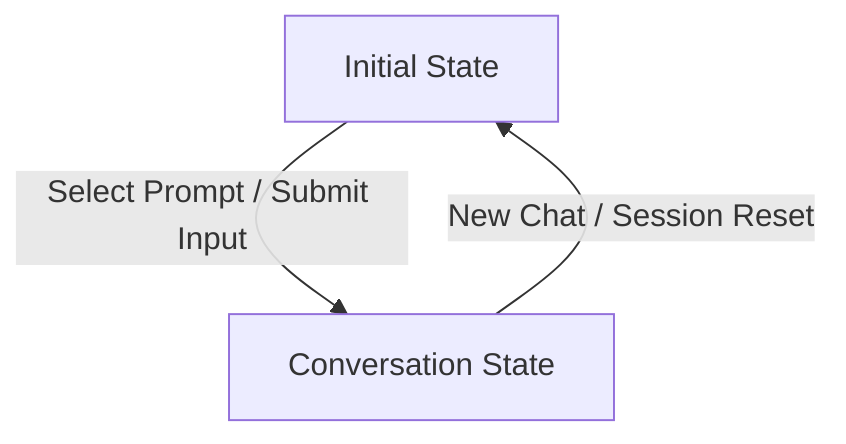

# Postie AI Assistant — Reusable Panel Specification

## 1. Executive Summary

- **Component Classification**: **SHARED COMPONENT — NOT SCREEN-SPECIFIC**
- **Location**: `src/components/PostiePanel.tsx`
- **Context & Mode Provider**: `src/context/PostieContext.tsx`
- **Primary Shell Width**: `360px` docked right panel (collapsible to 40x40 launcher or 400x460 floating window)

---

## 2. Shared State Model

Postie operates under a unified two-state lifecycle within the same visual shell:



### State A: `initial` (Zero Conversation History)
- **Identity Header**: 40px Animated Postie Icon, 24px Fraunces headline ("Postie"), and green `BETA` pill badge.
- **Suggested Starter Prompts**: Context-aware prompt cards rendered directly below the identity block.
- **Home Initial Prompts**:
  1. `What should I focus on first today?` (Triggers Kresge funding opportunity recommendation)
  2. `Help me prepare for tomorrow` (Triggers board update & story readiness overview)
- **Context Bar**: Shows active page context (`Home`, `Kresge Foundation`, `Youth Career Pathways`, `Connect`), attached context items, and `+ Add` context trigger.
- **Composer**: Active bottom input box with placeholder `"Ask Postie anything, or add context with +"`.

### State B: `conversation` (Active Chat History)
- **Compact Header**: 20px Animated Postie Icon, 14px title ("Postie"), and compact `BETA` badge with border divider.
- **User Messages**: Asymmetric bubble (`rounded-[8px_0px_8px_8px]`, `#FFFDF5` background, `#FFCC33` border), author `"You"`, timestamp `"Just now"`.
- **Postie Responses**: Asymmetric bubble (`rounded-[0px_12px_12px_12px]`, `#FAFAFA` background, `#E5E5E5` border), author `"Postie"`, copy button, timestamp `"Just now"`.
- **Grounded Context Chips**: `"Used"` metadata tags highlighting organizational evidence.
- **Inline Action Cards**: 30px interactive button controls (`Review opportunity`, `Prepare update`, etc.) for seamless mission execution.

---

## 3. Retreat Interaction Flow

1. **Session Start / Reset**:
   - Postie mounts in `initial` state with 0 messages.
   - Home displays the 2 starter prompts.
2. **"Ask Postie" Retreat Decision Option**:
   - When audience selects "Ask Postie", presenter remains on Home.
   - Postie initial state is the focal point.
   - Presenter clicks `"What should I focus on first today?"`.
   - Postie transitions to `conversation` and renders the Kresge recommendation.
   - Presenter clicks `"Review opportunity"` or presses `Space` on Presenter Dock to advance into the Kresge mission.
3. **Session Reset (`R` key / Reset action)**:
   - Returns Postie cleanly to `initial` state without leftover conversation artifacts.
   - Participant presence remains live and unaffected.

---

## 4. Reusable Configuration Interface

```typescript
export interface PostieSuggestion {
  id: string;
  text: string;
  iconName?: PosterChildIconName;
  response?: {
    text: string;
    usedContext?: string[];
    actions?: ActionItem[];
  };
}

export interface PostiePanelProps {
  scene?: Scene;
  winnerTitle?: string;
  decisionStatus?: DecisionStatus;
  activeDecisionId?: string;
  contextLabel?: string;
  suggestions?: PostieSuggestion[];
  initialState?: 'initial' | 'conversation';
  onActionClick?: (action: ActionItem) => void;
}
```
